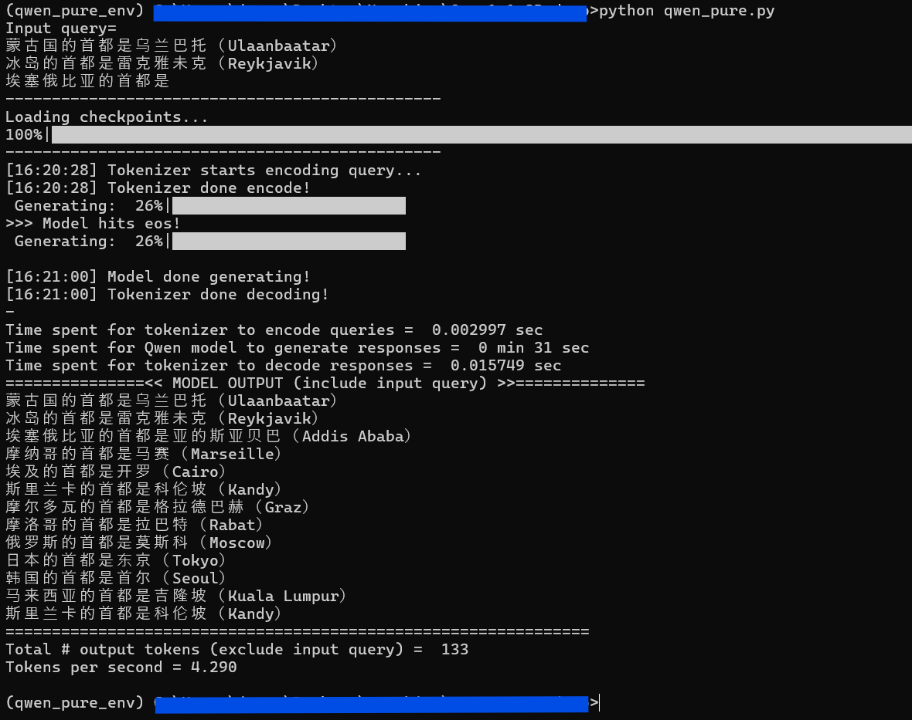

# This repo decouples the [Qwen 1.8B codebase](https://huggingface.co/Qwen/Qwen-1_8B) from the [transformers](https://github.com/huggingface/transformers) library

[`transformers`](https://github.com/huggingface/transformers), developed by Hugging Face, is one of the most widely used open-source libraries for Natural Language Processing (NLP) and beyond. It provides state-of-the-art pretrained models and simple APIs for all kinds of tasks. 

> It centralizes the model definition so that this definition is agreed upon across the ecosystem. `transformers` is the pivot across frameworks: if a model definition is supported, it will be compatible with the majority of training frameworks (Axolotl, Unsloth, DeepSpeed, FSDP, PyTorch-Lightning, ...), inference engines (vLLM, SGLang, TGI, ...), and adjacent modeling libraries (llama.cpp, mlx, ...) which leverage the model definition from `transformers`.

<h3 align="center">
    
Why I did this?

</h3>

There are several reasons why I decided to dedicate many hours to studying the [Qwen 1.8B codebase](https://huggingface.co/Qwen/Qwen-1_8B) so as to remove its dependency on `transformers` library:

1. To ensure I gained a **complete understanding** of the entire repo—not just the code itself, but also the mechanisms, mathematics, and algorithms that power the model.

2. To gain **hands-on experience** by re-implementing key components of the model instead of relying on pre-built abstractions.

3. To test my ability to safely disentangle the intricate relationship between the well-developed `transformers` library and the LLM model.

4. To reduce external dependencies, making the codebase **lighter and easier to deploy** in restricted environments, especially for those who cannot—or prefer not to—install the transformers library. 

<h3 align="center">
    
How to run the model?

</h3>

### This repo works with Python 3.8+ and PyTorch 2.0+

1. Install all required modules listed in `requirements.txt` (the installation command is provided at the top of the file)

2. Download [model-00001-of-00002.safetensors](https://huggingface.co/Qwen/Qwen-1_8B/blob/main/model-00001-of-00002.safetensors) & [model-00002-of-00002.safetensors](https://huggingface.co/Qwen/Qwen-1_8B/blob/main/model-00002-of-00002.safetensors) from the Qwen 1.8B repository on Hugging Face, as these weight files are too large to upload to GitHub.

3. Change the working directory to where `quen_pure.py` is

3. Run qwen_pure.py (It already contains an example query, so it's safe to execute)

4. (Optional) Study `quen_pure.py` to see how the model works

<h3 align="center">
    
Example Model Output

</h3>

Note: The default configuration in Qwen 1.8B has `top_p` set to **0.8**, so your output may differ from mine

<h3 align="center">
    
</h3>

